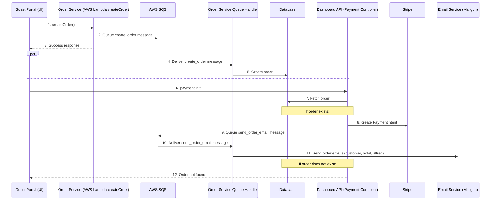

# Create Order Workflow

## Sequence Diagram


```mermaid
sequenceDiagram
    participant UI as Guest Portal (UI)
    participant OrderService_CreateOrder as Order Service (AWS Lambda createOrder)
    participant SQS as AWS SQS
    participant OrderService_QueueHandler as Order Service Queue Handler
    participant DB as Database
    participant DashboardAPI_PaymentController as Dashboard API (Payment Controller)
    participant Stripe as Stripe
    participant EmailService as Email Service (Mailgun)

    %% Step 1: UI sends createOrder request
    UI->>OrderService_CreateOrder: 1. createOrder()
    %% Step 2: Order Service queues message to SQS
    OrderService_CreateOrder->>SQS: 2. Queue create_order message
    %% Step 3: Order Service sends success response to UI
    OrderService_CreateOrder-->>UI: 3. Success response

    par
        %% Step 4: SQS delivers message to Order Service Queue Handler
        SQS->>OrderService_QueueHandler: 4. Deliver create_order message
        %% Step 5: Order Service Queue Handler creates order in DB
        OrderService_QueueHandler->>DB: 5. Create order
    and
        %% Step 6: UI initiates payment process
        UI->>DashboardAPI_PaymentController: 6. payment init
        %% Step 7: Retrieve order from database
        DashboardAPI_PaymentController->>DB: 7. Fetch order
    end
         
    note over DashboardAPI_PaymentController,DB: If order exists:  
    %% Step 8: Payment Controller creates PaymentIntent in Stripe
    DashboardAPI_PaymentController->>Stripe: 8. create PaymentIntent
    %% Step 9: Payment Controller emits event to send customer order email
    DashboardAPI_PaymentController->>SQS: 9. Queue send_order_email message
    %% Step 10: SQS delivers send customer order email message to Order Service Queue Handler
    SQS->>OrderService_QueueHandler: 10. Deliver send_order_email message
    %% Step 11: Order Service Queue Handler sends mail via email service (mailgun)
    OrderService_QueueHandler->>EmailService: 11. Send order emails (customer, hotel, alfred)
    
    note over DashboardAPI_PaymentController,DB: If order does not exist:
    DashboardAPI_PaymentController-->>UI: 12. Order not found
```

> [!NOTE]
> ```par``` is depicting the calls running in parallel

