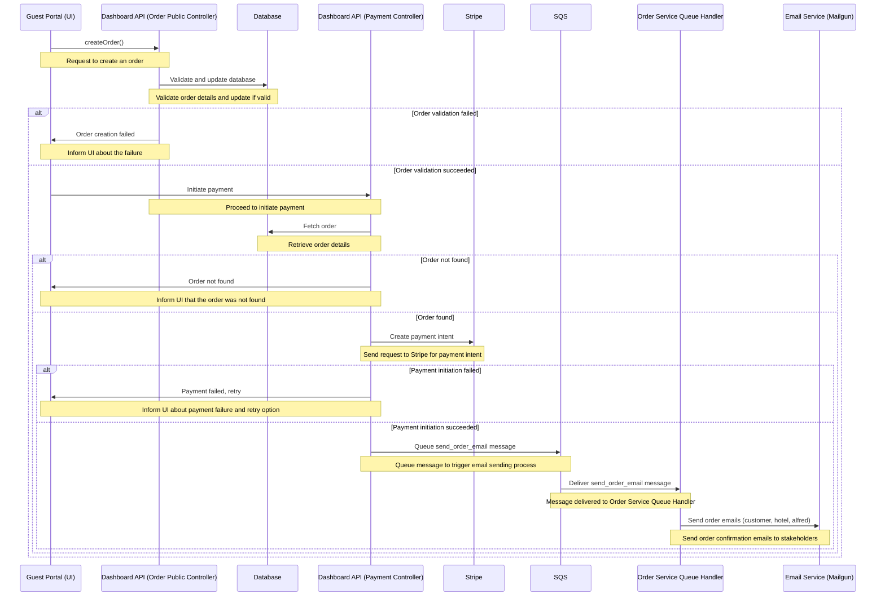

# Create Order Workflow
## Sequence Diagram

```mermaid
sequenceDiagram
   participant UI as Guest Portal (UI)
    participant DashboardAPI_PublicOrderController as Dashboard API (Order Public Controller)
    participant DB as Database
    participant DashboardAPI_PaymentController as Dashboard API (Payment Controller)
    participant Stripe as Stripe
    participant SQS as SQS
    participant OrderService_QueueHandler as Order Service Queue Handler
    participant EmailService as Email Service (Mailgun)

    %% Step 1: UI sends createOrder request
    UI->>DashboardAPI_PublicOrderController: createOrder()
    note over UI,DashboardAPI_PublicOrderController: Request to create an order
    
    %% Step 2: Dashboard API (Order Public Controller) validates and updates the database
    DashboardAPI_PublicOrderController->>DB: Validate and update database
    note over DashboardAPI_PublicOrderController,DB: Validate order details and update if valid

    alt Order validation failed
        %% Step 3: Send failure message to UI
        DashboardAPI_PublicOrderController->>UI: Order creation failed
        note over DashboardAPI_PublicOrderController,UI: Inform UI about the failure
    else Order validation succeeded
        %% Step 4: Initiate payment
        UI->>DashboardAPI_PaymentController: Initiate payment
        note over DashboardAPI_PublicOrderController,DashboardAPI_PaymentController: Proceed to initiate payment

        %% Step 5: Retrieve order from database
        DashboardAPI_PaymentController->>DB: Fetch order
        note over DashboardAPI_PaymentController,DB: Retrieve order details

        alt Order not found
            %% Step 6: Send order not found message to UI
            DashboardAPI_PaymentController->>UI: Order not found
            note over DashboardAPI_PaymentController,UI: Inform UI that the order was not found
        else Order found
            %% Step 7: Create payment intent
            DashboardAPI_PaymentController->>Stripe: Create payment intent
            note over DashboardAPI_PaymentController,Stripe: Send request to Stripe for payment intent

            alt Payment initiation failed
                %% Step 8: Send payment failed message to UI
                DashboardAPI_PaymentController->>UI: Payment failed, retry
                note over DashboardAPI_PaymentController,UI: Inform UI about payment failure and retry option
            else Payment initiation succeeded
                %% Step 9: Payment Controller emits event to send customer order email
                DashboardAPI_PaymentController->>SQS: Queue send_order_email message
                note over DashboardAPI_PaymentController,SQS: Queue message to trigger email sending process

                %% Step 10: SQS delivers send customer order email message to Order Service Queue Handler
                SQS->>OrderService_QueueHandler: Deliver send_order_email message
                note over SQS,OrderService_QueueHandler: Message delivered to Order Service Queue Handler

                %% Step 11: Order Service Queue Handler sends mail via email service (mailgun)
                OrderService_QueueHandler->>EmailService: Send order emails (customer, hotel, alfred)
                note over OrderService_QueueHandler,EmailService: Send order confirmation emails to stakeholders
            end
        end
    end
```

