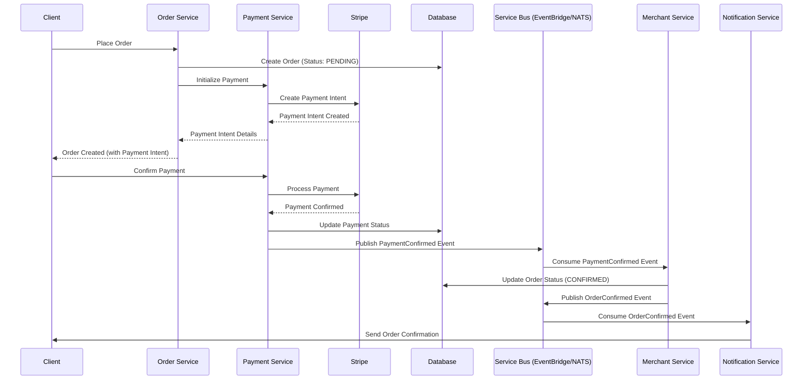

# Order Flow with Microservices

```mermaid
sequenceDiagram
    participant C as Client
    participant OS as Order Service
    participant PS as Payment Service
    participant S as Stripe
    participant DB as Database
    participant Q as Service Bus (EventBridge/NATS)
    participant MS as Merchant Service
    participant NS as Notification Service

    C->>OS: Place Order
    OS->>DB: Create Order (Status: PENDING)
    OS->>PS: Initialize Payment
    PS->>S: Create Payment Intent
    S-->>PS: Payment Intent Created
    PS-->>OS: Payment Intent Details
    OS-->>C: Order Created (with Payment Intent)
    
    C->>PS: Confirm Payment
    PS->>S: Process Payment
    S-->>PS: Payment Confirmed
    PS->>DB: Update Payment Status
    PS->>Q: Publish PaymentConfirmed Event
    
    Q->>MS: Consume PaymentConfirmed Event
    MS->>DB: Update Order Status (CONFIRMED)
    MS->>Q: Publish OrderConfirmed Event
    
    Q->>NS: Consume OrderConfirmed Event
    NS->>C: Send Order Confirmation
```