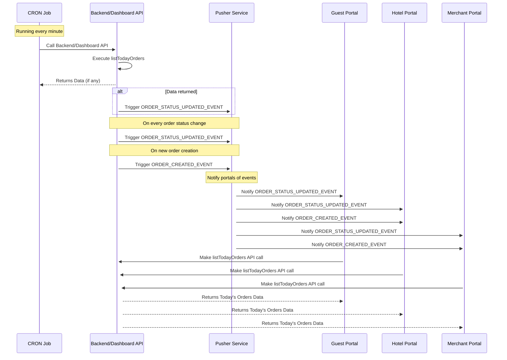

# Pusher service workflow
## Sequence Diagram

```mermaid
sequenceDiagram
    participant CRON as CRON Job
    participant API as Backend/Dashboard API
    participant Pusher as Pusher Service
    participant GuestPortal as Guest Portal
    participant HotelPortal as Hotel Portal
    participant MerchantPortal as Merchant Portal

    Note over CRON: Running every minute
    CRON->>+API: Call Backend/Dashboard API
    API->>API: Execute listTodayOrders
    API-->>CRON: Returns Data (if any)
    
    alt Data returned
        API->>+Pusher: Trigger ORDER_STATUS_UPDATED_EVENT
    end
    
    Note over API, Pusher: On every order status change
    API->>+Pusher: Trigger ORDER_STATUS_UPDATED_EVENT
    
    Note over API, Pusher: On new order creation
    API->>+Pusher: Trigger ORDER_CREATED_EVENT
    
    Note over Pusher: Notify portals of events
    Pusher->>+GuestPortal: Notify ORDER_STATUS_UPDATED_EVENT
    Pusher->>+HotelPortal: Notify ORDER_STATUS_UPDATED_EVENT
    Pusher->>+HotelPortal: Notify ORDER_CREATED_EVENT
    Pusher->>+MerchantPortal: Notify ORDER_STATUS_UPDATED_EVENT
    Pusher->>+MerchantPortal: Notify ORDER_CREATED_EVENT
    GuestPortal->>+API: Make listTodayOrders API call
    HotelPortal->>+API: Make listTodayOrders API call
    MerchantPortal->>+API: Make listTodayOrders API call
    API-->>GuestPortal: Returns Today's Orders Data
    API-->>HotelPortal: Returns Today's Orders Data
    API-->>MerchantPortal: Returns Today's Orders Data

```