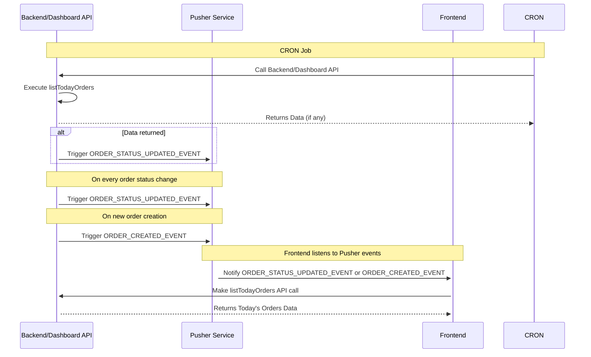

# Pusher service proposed workflow
## Sequence Diagram

```mermaid
sequenceDiagram
    participant API as Backend/Dashboard API
    participant Pusher as Pusher Service
    participant Frontend as Frontend

    rect rgba(255,255,255, 0.03)
        Note over API, CRON: CRON Job
        CRON->>+API:Call Backend/Dashboard API
        API->>API: Execute listTodayOrders
        API-->>CRON: Returns Data (if any)    
    alt Data returned
        API->>+Pusher: Trigger ORDER_STATUS_UPDATED_EVENT
    end
    end
    
    Note over API, Pusher: On every order status change
    API->>+Pusher: Trigger ORDER_STATUS_UPDATED_EVENT

    Note over API, Pusher: On new order creation
    API->>+Pusher: Trigger ORDER_CREATED_EVENT

    Note over Frontend, Pusher: Frontend listens to Pusher events
    Pusher->>+Frontend: Notify ORDER_STATUS_UPDATED_EVENT or ORDER_CREATED_EVENT


    Frontend->>+API: Make listTodayOrders API call
    API-->>Frontend: Returns Today's Orders Data

```