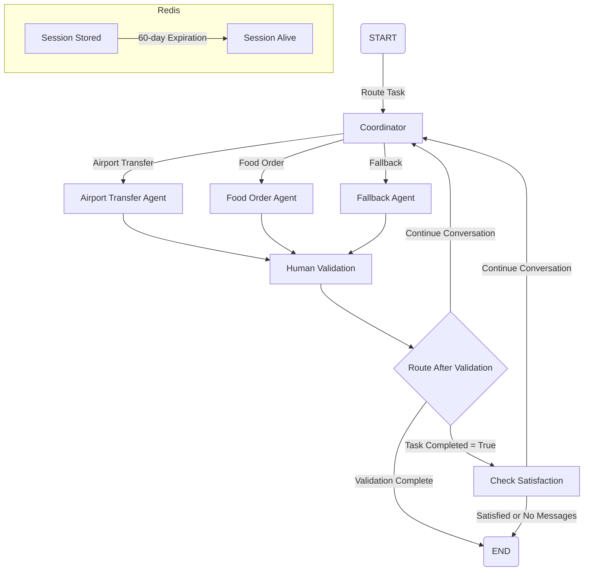

```mermaid
graph TD
    A(START) -->|Route Task| B[Coordinator]
    
    B -->|Airport Transfer| C[Airport Transfer Agent]
    B -->|Food Order| D[Food Order Agent]
    B -->|Fallback| E[Fallback Agent]
    
    C --> F[Human Validation]
    D --> F[Human Validation]
    E --> F[Human Validation]
    
    F --> G{Route After Validation}
    
    G -->|Task Completed = True| H[Check Satisfaction]
    G -->|Validation Complete | I(END)
    G -->|Continue Conversation| B
    
    H -->|Satisfied or No Messages| I(END)
    H -->|Continue Conversation| B
    
    subgraph Redis
        J[Session Stored]
        J -->|60-day Expiration| K[Session Alive]
    end
    %% Note: Direct connection from F to J is removed to avoid parsing issues; session storage is implied after validation
```