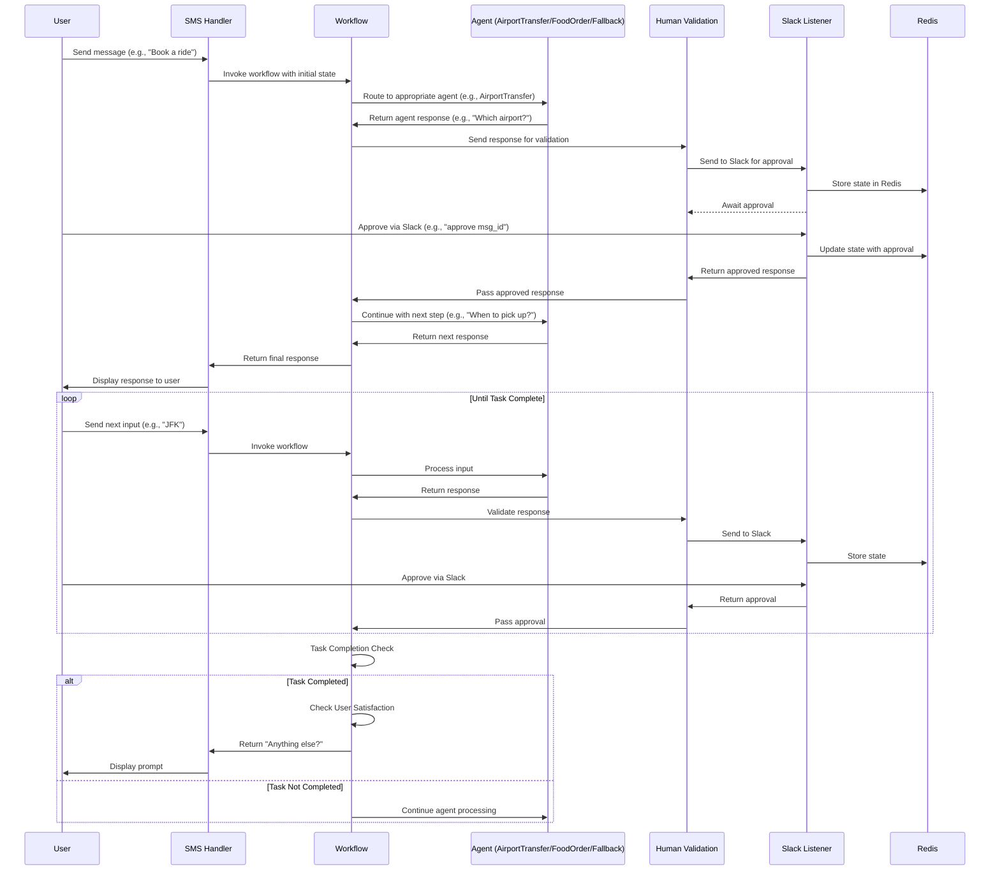

```mermaid
sequenceDiagram
    participant U as User
    participant SH as SMS Handler
    participant W as Workflow
    participant A as Agent (AirportTransfer/FoodOrder/Fallback)
    participant HV as Human Validation
    participant SL as Slack Listener
    participant R as Redis

    U->>SH: Send message (e.g., "Book a ride")
    SH->>W: Invoke workflow with initial state
    W->>A: Route to appropriate agent (e.g., AirportTransfer)
    A->>W: Return agent response (e.g., "Which airport?")
    W->>HV: Send response for validation
    HV->>SL: Send to Slack for approval
    SL->>R: Store state in Redis
    SL-->>HV: Await approval
    U->>SL: Approve via Slack (e.g., "approve msg_id")
    SL->>R: Update state with approval
    SL->>HV: Return approved response
    HV->>W: Pass approved response
    W->>A: Continue with next step (e.g., "When to pick up?")
    A->>W: Return next response
    W->>SH: Return final response
    SH->>U: Display response to user

    loop Until Task Complete
        U->>SH: Send next input (e.g., "JFK")
        SH->>W: Invoke workflow
        W->>A: Process input
        A->>W: Return response
        W->>HV: Validate response
        HV->>SL: Send to Slack
        SL->>R: Store state
        U->>SL: Approve via Slack
        SL->>HV: Return approval
        HV->>W: Pass approval
    end

    W->>W: Task Completion Check
    alt Task Completed
        W->>W: Check User Satisfaction
        W->>SH: Return "Anything else?"
        SH->>U: Display prompt
    else Task Not Completed
        W->>A: Continue agent processing
    end
```